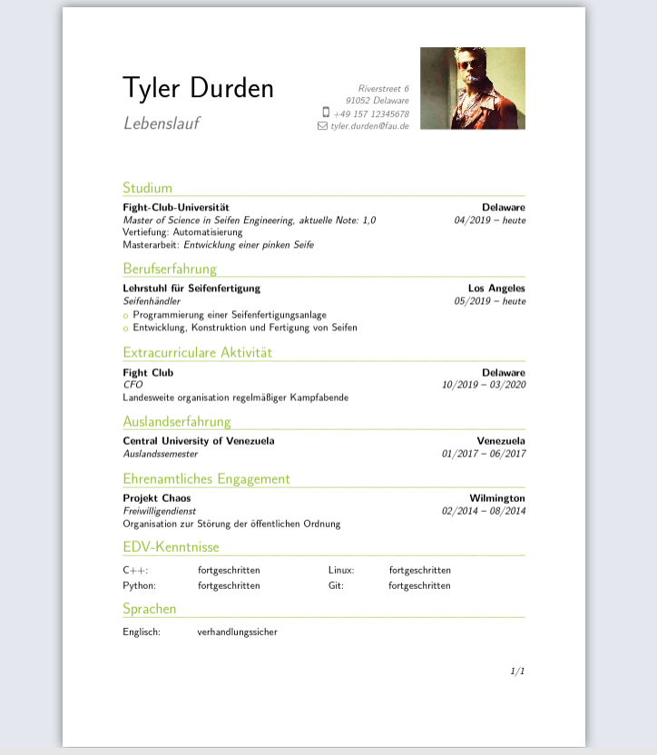

# Modern-CV-Modification
This repository contains the latex files for a Curriculum Vitae based on the moderncv class. The main modification is the combination of the "modern" style header with the "banking" style listing.
Moreover you can use a custom color by setting the rgb values in the [moderncvcolormycolor.sty](moderncvcolormycolor.sty)

 

